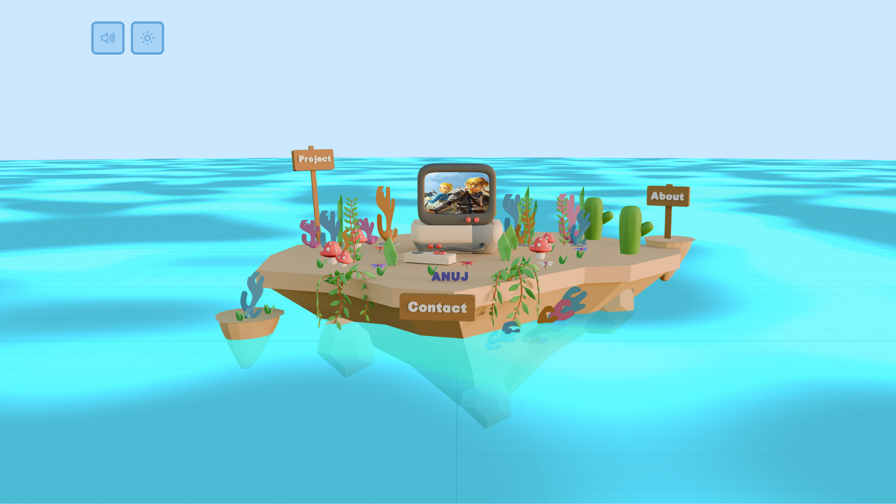
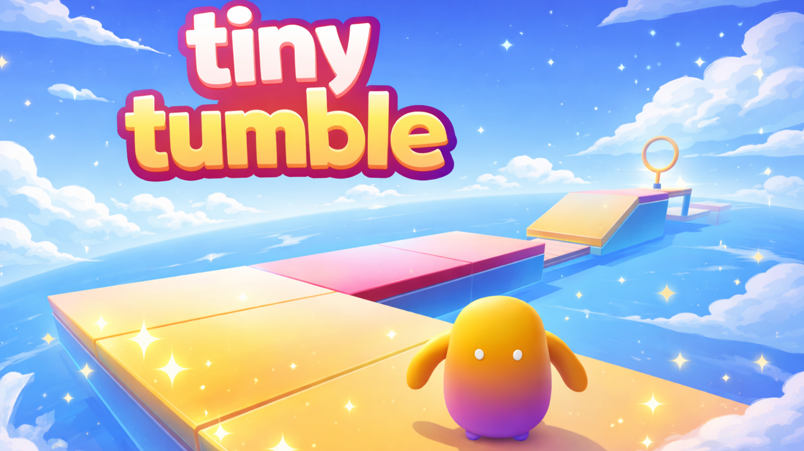
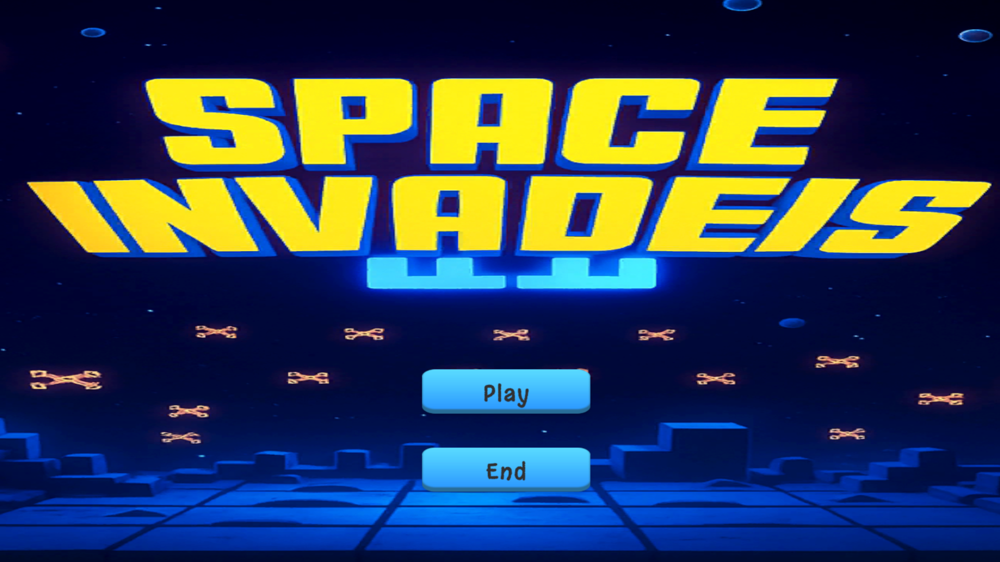
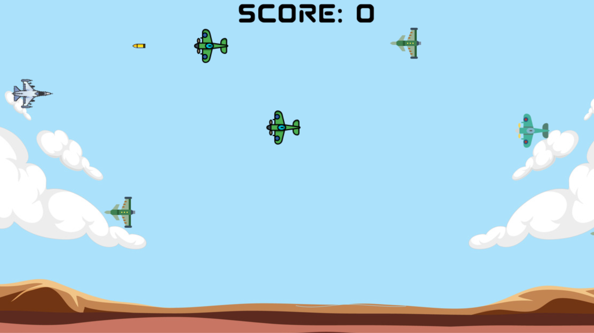
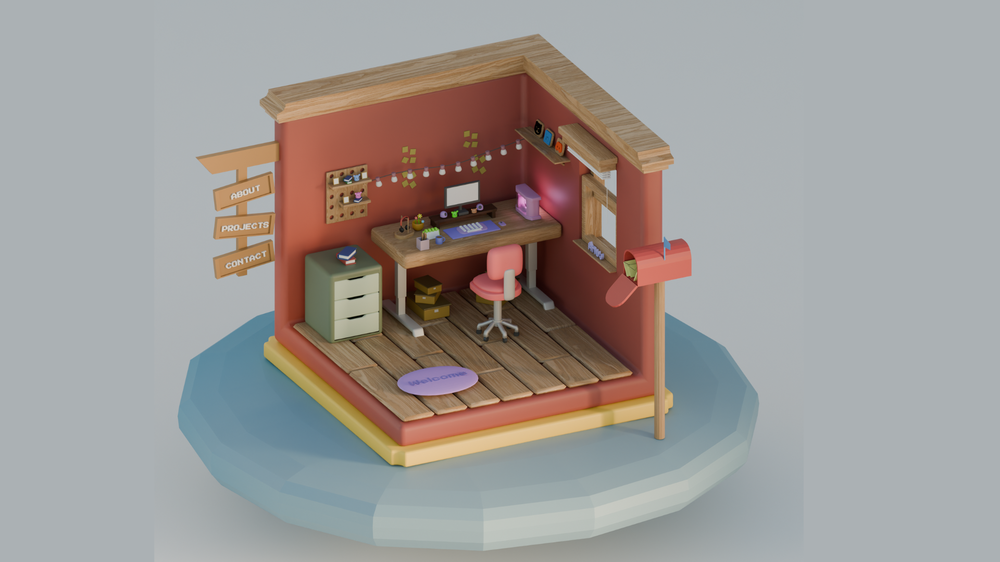

# Hey there 👋 ! I'm Anuj Jadhav

---

## Find me ↘

📝 Portfolio: https://anuj-device.vercel.app  
💼 LinkedIn: www.linkedin.com/in/anuj-jadhav-8814b5302  
🐦 Twitter: https://x.com/Anuj327992

<!-- PROJECT-TABLE-START -->

## Projects 7 ↘

<table>

<tr>
<!-- Portfolio -->
<td align="center">
  
   ⎯⎯⎯⎯ 
  <strong>Portfolio</strong> 
  <a href="https://anuj-device.vercel.app/">Live</a>
</td>

<!-- Tiny Tumble -->
<td align="center">
  
   ⎯⎯⎯⎯ 
  <strong>Tiny Tumble</strong> 
  <a href="https://github.com/Anuj0720/tiny-tumble">Code</a> ·
  <a href="https://tiny-tumble.vercel.app/">Live</a>
</td>

<!-- Rocket Boost -->
<td align="center">
  
   ⎯⎯⎯⎯ 
  <strong>Rocket Boost</strong> 
  <a href="https://github.com/Anuj0720/Rocket-Boost">Code</a> ·
  <a href="https://anuj0720.github.io/Rocket-Boost/">Live</a>
</td>
</tr>

<tr>
<!-- Space Invaders -->
<td align="center">
  
   ⎯⎯⎯⎯ 
  <strong>Space Invaders</strong> 
  <a href="https://github.com/Anuj0720/Space-Invaders">Code</a>
</td>

<!-- Fighter -->
<td align="center">
  
   ⎯⎯⎯⎯ 
  <strong>Fighter</strong> 
  <a href="https://github.com/Anuj0720/Fighter">Code</a>
</td>

<!-- Roomfolio -->
<td align="center">
  
   ⎯⎯⎯⎯ 
  <strong>Roomfolio</strong> 
  <a href="https://anujroomfolio.vercel.app/">Live</a>
</td>
</tr>

<tr>
<!-- Catcher -->
<td align="center">
  
   ⎯⎯⎯⎯ 
  <strong>Catcher</strong> 
  <a href="https://github.com/Anuj0720/Catcher">Code</a>
</td>
</tr>

</table>

<!-- PROJECT-TABLE-END -->
